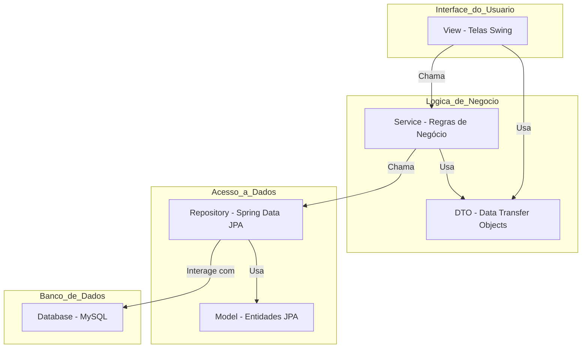
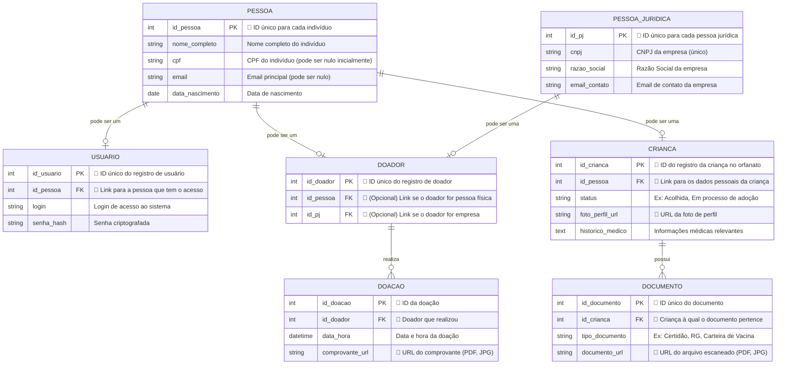

# Sistema de Gestão CEAMEC


## 📄 Descrição

Este projeto é um sistema de gestão de desktop (SIG) desenvolvido para a ONG CEAMEC, um orfanato que realiza um trabalho fundamental no acolhimento de crianças. O objetivo principal do sistema é modernizar e centralizar o controle de informações essenciais, otimizando a gestão de doações, doadores e das crianças acolhidas.

A aplicação está sendo construída com uma interface de usuário simples e funcional utilizando Java Swing, com uma arquitetura de back-end robusta impulsionada por Spring Boot e Spring Data JPA.

## ✨ Funcionalidades Planejadas

O sistema visa cobrir as seguintes áreas em seu desenvolvimento:

-   [ ] **Autenticação:** Tela de login para acesso administrativo ao sistema.
-   [ ] **Gestão de Doadores:** CRUD (Criar, Ler, Atualizar, Deletar) completo para o cadastro de pessoas físicas e jurídicas que apoiam a ONG.
-   [ ] **Gestão de Crianças:** Controle de informações das crianças acolhidas, como dados pessoais, data de chegada e situação atual.
-   [ ] **Registro de Doações:** Lançamento de doações recebidas (financeiras ou de itens), vinculando-as a um doador e registrando a data e o tipo de doação.
-   [ ] **Relatórios Simples:** Geração de listas e relatórios básicos (ex: lista de doadores, doações por período).

## 🛠️ Tecnologias Utilizadas

A pilha de tecnologia para este projeto foi escolhida para combinar robustez, produtividade e facilidade de manutenção.

-   **Linguagem:** Java 17+
-   **Framework Principal:** Spring Boot
-   **Acesso a Dados:** Spring Data JPA / Hibernate
-   **Interface Gráfica (UI):** Java Swing
    -   **Look and Feel:** [FlatLaf](https://www.formdev.com/flatlaf/) para uma aparência moderna.
    -   **Builder:** NetBeans GUI Builder
-   **Banco de Dados (Desenvolvimento):** MySQL
-   **Build & Dependências:** Apache Maven
-   **Utilitários:** Lombok

## ⚙️ Pré-requisitos

Antes de começar, garanta que você tenha as seguintes ferramentas instaladas em seu ambiente de desenvolvimento:

-   [JDK (Java Development Kit)](https://www.oracle.com/java/technologies/downloads/) - Versão 17 ou superior.
-   [Apache Maven](https://maven.apache.org/download/cgi) - Para gerenciamento de dependências.
-   [Git](https://git-scm.com/) - Para controle de versão.
-   [Apache NetBeans](https://netbeans.apache.org/download/index.html) - IDE recomendada devido ao uso do GUI Builder.

## 🚀 Como Executar o Projeto

Siga os passos abaixo para executar a aplicação localmente:

1.  **Clone o repositório:**
    ```bash
    git clone https://github.com/liceki/CEAMEC.git
    cd CEAMEC
    ```

2.  **Abra o projeto no NetBeans:**
    -   Vá em `Arquivo > Abrir Projeto...`.
    -   Selecione a pasta `CEAMEC` que você clonou.
    -   Aguarde o NetBeans carregar o projeto e o Maven baixar todas as dependências (pode levar alguns minutos na primeira vez).

3.  **Execute a aplicação:**
    -   Encontre a classe principal `GestaoCeamecApplication.java` no pacote `br.org.ceamec.gestao`.
    -   Clique com o botão direito sobre o arquivo e selecione `Executar Arquivo`.
    -   A aplicação Spring será inicializada no console e a tela principal (definida no método `main`) será exibida.

## 🏗️ Estrutura do Projeto

O projeto segue uma arquitetura de camadas bem definida para garantir a separação de responsabilidades:

-   `br.org.ceamec.gestao`
    -   `view/`: Contém todas as classes da interface gráfica (JFrames, JPanels, JDialogs), organizadas em sub-pacotes por funcionalidade.
    -   `dto/`: Contém os Data Transfer Objects (Records) para transportar dados entre a camada de `view` e a de `service`.
    -   `service/`: Camada de serviço, onde reside toda a lógica de negócio da aplicação.
    -   `model/`: As entidades JPA que mapeiam as tabelas do banco de dados (ex: `Doador`, `Crianca`).
    -   `repository/`: Interfaces do Spring Data JPA para acesso e manipulação do banco de dados.

## 📊 Diagramas

Esta seção contém diagramas que ilustram a arquitetura e o modelo de dados do projeto.

### Arquitetura de Camadas

O sistema segue uma arquitetura de camadas clássica para garantir a separação de responsabilidades.



### Modelo de Dados (Entidade-Relacionamento)

Este diagrama mostra as principais entidades do sistema e como elas se relacionam.



## 🤝 Contribuição

Contribuições são o que tornam a comunidade de código aberto um lugar incrível para aprender, inspirar e criar. Qualquer contribuição que você fizer será **muito bem-vinda**.

1.  Faça um Fork do projeto
2.  Crie uma Branch para sua feature (`git checkout -b feature/FuncionalidadeIncrivel`)
3.  Faça o Commit de suas mudanças (`git commit -m 'Adiciona FuncionalidadeIncrivel'`)
4.  Faça o Push para a Branch (`git push origin feature/FuncionalidadeIncrivel`)
5.  Abra um Pull Request

## ⚖️ Licença

Este projeto está licenciado sob a Licença MIT - veja o arquivo [LICENSE.md](LICENSE.md) para mais detalhes.

---
