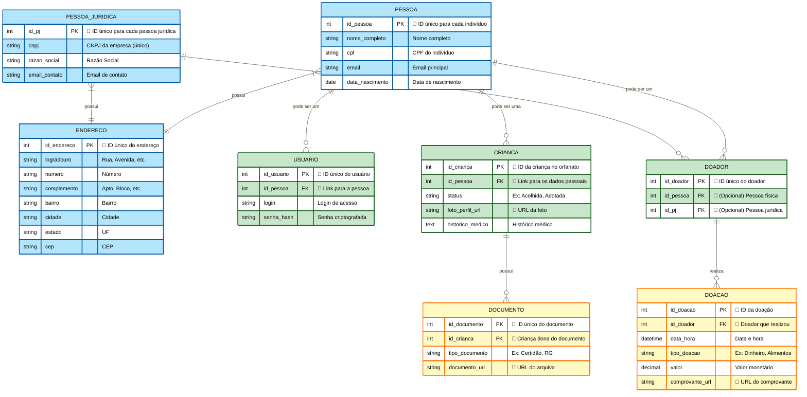

```mermaid
erDiagram

    PESSOA {
        int id_pessoa PK "🔑 ID único para cada indivíduo"
        string nome_completo "Nome completo"
        string cpf "CPF do indivíduo"
        string email "Email principal"
        date data_nascimento "Data de nascimento"
    }

    PESSOA_JURIDICA {
        int id_pj PK "🔑 ID único para cada pessoa jurídica"
        string cnpj "CNPJ da empresa (único)"
        string razao_social "Razão Social"
        string email_contato "Email de contato"
    }

    ENDERECO {
        int id_endereco PK "🔑 ID único do endereço"
        string logradouro "Rua, Avenida, etc."
        string numero "Número"
        string complemento "Apto, Bloco, etc."
        string bairro "Bairro"
        string cidade "Cidade"
        string estado "UF"
        string cep "CEP"
    }

    USUARIO {
        int id_usuario PK "🔑 ID único do usuário"
        int id_pessoa FK "🔗 Link para a pessoa"
        string login "Login de acesso"
        string senha_hash "Senha criptografada"
    }

    DOADOR {
        int id_doador PK "🔑 ID único do doador"
        int id_pessoa FK "🔗 (Opcional) Pessoa física"
        int id_pj FK "🔗 (Opcional) Pessoa jurídica"
    }

    CRIANCA {
        int id_crianca PK "🔑 ID da criança no orfanato"
        int id_pessoa FK "🔗 Link para os dados pessoais"
        string status "Ex: Acolhida, Adotada"
        string foto_perfil_url "🔗 URL da foto"
        text historico_medico "Histórico médico"
    }

    DOACAO {
        int id_doacao PK "🔑 ID da doação"
        int id_doador FK "🔗 Doador que realizou"
        datetime data_hora "Data e hora"
        string tipo_doacao "Ex: Dinheiro, Alimentos"
        decimal valor "Valor monetário"
        string comprovante_url "🔗 URL do comprovante"
    }

    DOCUMENTO {
        int id_documento PK "🔑 ID único do documento"
        int id_crianca FK "🔗 Criança dona do documento"
        string tipo_documento "Ex: Certidão, RG"
        string documento_url "🔗 URL do arquivo"
    }

    PESSOA }|--|| ENDERECO : "possui"
    PESSOA_JURIDICA }|--|| ENDERECO : "possui"
    PESSOA ||--o{ USUARIO : "pode ser um"
    PESSOA ||--o{ DOADOR : "pode ser um"
    PESSOA ||--o{ CRIANCA : "pode ser uma"
    PESSOA_JURIDICA ||--o{ DOADOR : "pode ser uma"
    DOADOR ||--o{ DOACAO : "realiza"
    CRIANCA ||--o{ DOCUMENTO : "possui"

    classDef base fill:#B3E5FC,stroke:#01579B,stroke-width:2px,color:black
    classDef roles fill:#C8E6C9,stroke:#1B5E20,stroke-width:2px,color:black
    classDef transactions fill:#FFF9C4,stroke:#FF6F00,stroke-width:2px,color:black
    class PESSOA,PESSOA_JURIDICA,ENDERECO base
    class USUARIO,DOADOR,CRIANCA roles
    class DOACAO,DOCUMENTO transactions
```
