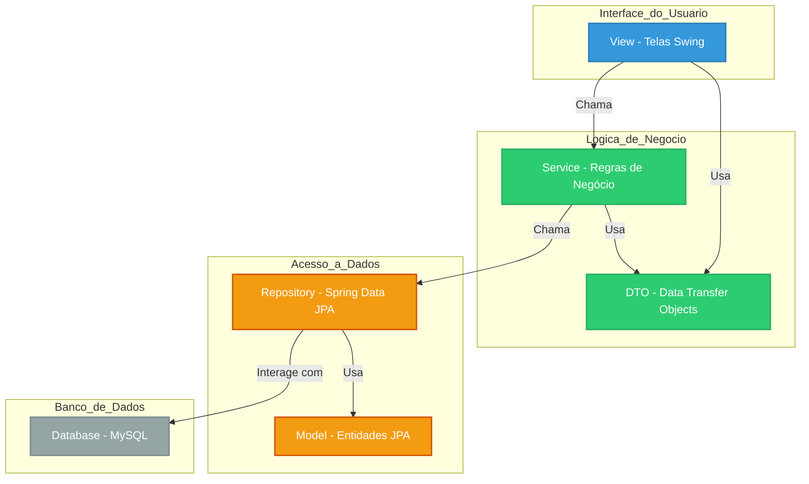

```mermaid
graph TD;
    subgraph Interface_do_Usuario
        A[View - Telas Swing];
    end
    subgraph Logica_de_Negocio
        B[Service - Regras de Negócio];
        C[DTO - Data Transfer Objects];
    end
    subgraph Acesso_a_Dados
        D[Repository - Spring Data JPA];
        E[Model - Entidades JPA];
    end
    subgraph Banco_de_Dados
        F[Database - MySQL];
    end

    A -- Usa --> C;
    A -- Chama --> B;
    B -- Usa --> C;
    B -- Chama --> D;
    D -- Usa --> E;
    D -- Interage com --> F;

    %% ---- Definição do Estilo Moderno e Forte ----
    classDef viewStyle fill:#3498db,stroke:#2980b9,stroke-width:2px,color:#fff
    classDef logicStyle fill:#2ecc71,stroke:#27ae60,stroke-width:2px,color:#fff
    classDef dataStyle fill:#f39c12,stroke:#d35400,stroke-width:2px,color:#fff
    classDef dbStyle fill:#95a5a6,stroke:#7f8c8d,stroke-width:2px,color:#fff

    %% ---- Aplicação dos Estilos ----
    class A viewStyle
    class B,C logicStyle
    class D,E dataStyle
    class F dbStyle
```
