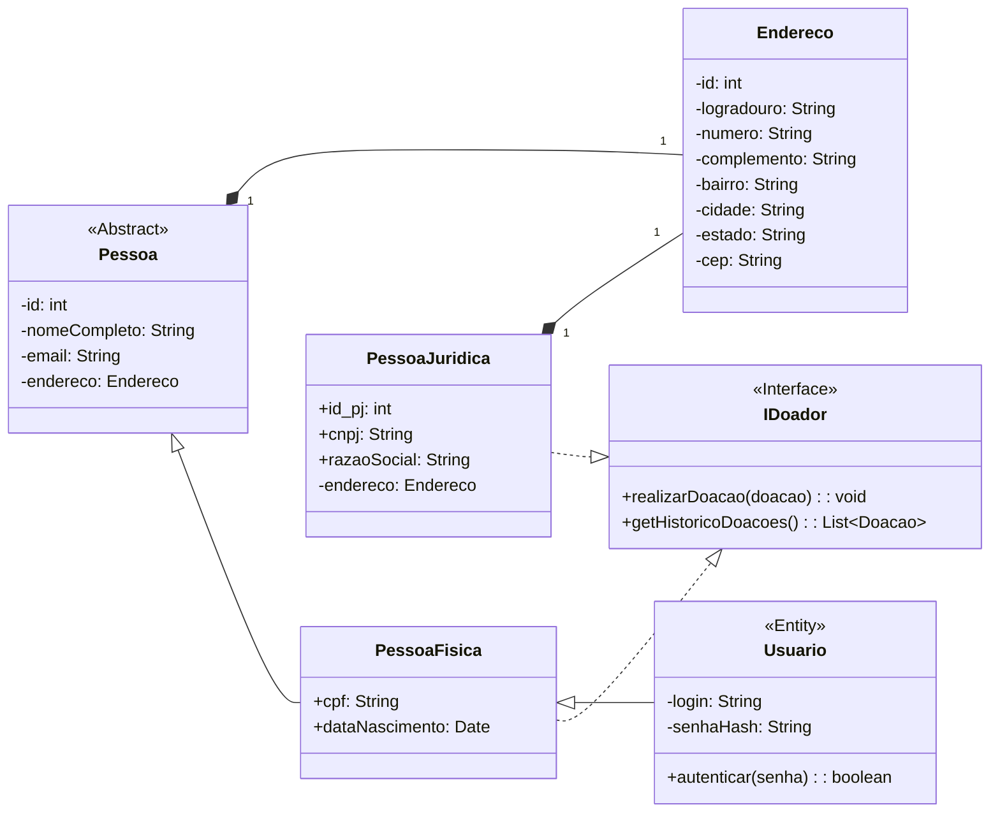

```mermaid
classDiagram
    direction LR

    class Pessoa {
        <<Abstract>>
        -id: int
        -nomeCompleto: String
        -email: String
        -endereco: Endereco
    }

    class PessoaFisica {
        +cpf: String
        +dataNascimento: Date
    }

    class PessoaJuridica {
        +id_pj: int
        +cnpj: String
        +razaoSocial: String
        -endereco: Endereco
    }

    class Endereco {
        -id: int
        -logradouro: String
        -numero: String
        -complemento: String
        -bairro: String
        -cidade: String
        -estado: String
        -cep: String
    }

    class IDoador {
        <<Interface>>
        +realizarDoacao(doacao): void
        +getHistoricoDoacoes(): List~Doacao~
    }

    class Usuario {
        <<Entity>>
        -login: String
        -senhaHash: String
        +autenticar(senha): boolean
    }

    Pessoa "1" *-- "1" Endereco
    PessoaJuridica "1" *-- "1" Endereco

    Pessoa <|-- PessoaFisica
    PessoaFisica <|-- Usuario
    
    PessoaFisica ..|> IDoador
    PessoaJuridica ..|> IDoador

```