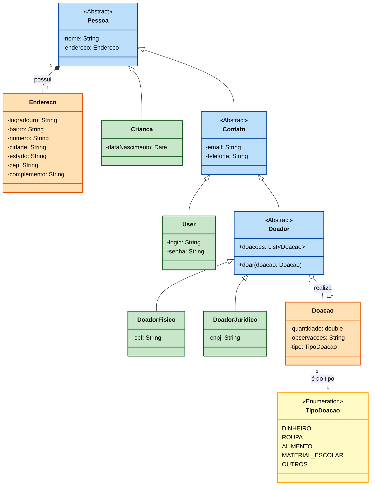

```mermaid
classDiagram
    direction TD

    class Pessoa:::base {
        <<Abstract>>
        -nome: String
        -endereco: Endereco
    }

    class Endereco:::owned {
        -logradouro: String
        -bairro: String
        -numero: String
        -cidade: String
        -estado: String
        -cep: String
        -complemento: String
    }

    class Crianca:::entities {
        -dataNascimento: Date
    }

    class Contato:::base {
        <<Abstract>>
        -email: String
        -telefone: String
    }

    class User:::entities {
        -login: String
        -senha: String
    }

    class Doador:::base {
        <<Abstract>>
        +doacoes: List~Doacao~
        +doar(doacao: Doacao)
    }

    class DoadorFisico:::entities {
        -cpf: String
    }

    class DoadorJuridico:::entities {
        -cnpj: String
    }

    class Doacao:::owned {
        -quantidade: double
        -observacoes: String
        -tipo: TipoDoacao
    }

    class TipoDoacao:::enum {
        <<Enumeration>>
        DINHEIRO
        ROUPA
        ALIMENTO
        MATERIAL_ESCOLAR
        OUTROS
    }
    
    Pessoa "1" *-- "1" Endereco : possui
    Doador "1" o-- "1..*" Doacao : realiza
    Doacao "1" -- "1" TipoDoacao : é do tipo 
    
    Pessoa <|-- Crianca
    Pessoa <|-- Contato

    Contato <|-- User
    Contato <|-- Doador

    Doador <|-- DoadorFisico
    Doador <|-- DoadorJuridico
    
    classDef base fill:#BBDEFB,stroke:#0D47A1,stroke-width:2px,color:black
    classDef entities fill:#C8E6C9,stroke:#1B5E20,stroke-width:2px,color:black
    classDef owned fill:#FFE0B2,stroke:#E65100,stroke-width:2px,color:black
    classDef enum fill:#FFF9C4,stroke:#FFA000,stroke-width:2px,color:black
    
```