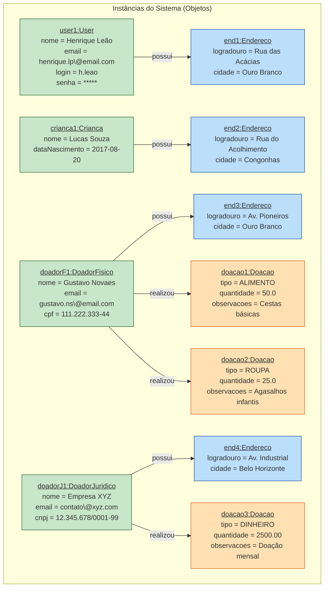

```mermaid
graph TD
    subgraph "Instâncias do Sistema (Objetos)"

    %% --- Definição dos Objetos ---

    objUser["<u>user1:User</u><br/>nome = Henrique Leão<br/>email = henrique.lp\@email.com<br/>login = h.leao<br/>senha = *****"]
    objUserEndereco["<u>end1:Endereco</u><br/>logradouro = Rua das Acácias<br/>cidade = Ouro Branco"]
    
    objCrianca["<u>crianca1:Crianca</u><br/>nome = Lucas Souza<br/>dataNascimento = 2017-08-20"]
    objCriancaEndereco["<u>end2:Endereco</u><br/>logradouro = Rua do Acolhimento<br/>cidade = Congonhas"]

    objDoadorF["<u>doadorF1:DoadorFisico</u><br/>nome = Gustavo Novaes<br/>email = gustavo.ns\@email.com<br/>cpf = 111.222.333-44"]
    objDoadorFEndereco["<u>end3:Endereco</u><br/>logradouro = Av. Pioneiros<br/>cidade = Ouro Branco"]
    
    objDoadorJ["<u>doadorJ1:DoadorJuridico</u><br/>nome = Empresa XYZ<br/>email = contato\@xyz.com<br/>cnpj = 12.345.678/0001-99"]
    objDoadorJEndereco["<u>end4:Endereco</u><br/>logradouro = Av. Industrial<br/>cidade = Belo Horizonte"]

    objDoacao1["<u>doacao1:Doacao</u><br/>tipo = ALIMENTO<br/>quantidade = 50.0<br/>observacoes = Cestas básicas"]
    objDoacao2["<u>doacao2:Doacao</u><br/>tipo = ROUPA<br/>quantidade = 25.0<br/>observacoes = Agasalhos infantis"]
    objDoacao3["<u>doacao3:Doacao</u><br/>tipo = DINHEIRO<br/>quantidade = 2500.00<br/>observacoes = Doação mensal"]
    
    %% --- Links entre os Objetos ---
    
    objUser -- "possui" --> objUserEndereco
    objCrianca -- "possui" --> objCriancaEndereco
    objDoadorF -- "possui" --> objDoadorFEndereco
    objDoadorJ -- "possui" --> objDoadorJEndereco

    objDoadorF -- "realizou" --> objDoacao1
    objDoadorF -- "realizou" --> objDoacao2
    objDoadorJ -- "realizou" --> objDoacao3
    
    end
    
    %% --- Estilização ---
    style objUser fill:#c8e6c9,stroke:#1B5E20
    style objCrianca fill:#c8e6c9,stroke:#1B5E20
    style objDoadorF fill:#c8e6c9,stroke:#1B5E20
    style objDoadorJ fill:#c8e6c9,stroke:#1B5E20
    
    style objDoacao1 fill:#FFE0B2,stroke:#E65100
    style objDoacao2 fill:#FFE0B2,stroke:#E65100
    style objDoacao3 fill:#FFE0B2,stroke:#E65100

    style objUserEndereco fill:#BBDEFB,stroke:#0D47A1
    style objCriancaEndereco fill:#BBDEFB,stroke:#0D47A1
    style objDoadorFEndereco fill:#BBDEFB,stroke:#0D47A1
    style objDoadorJEndereco fill:#BBDEFB,stroke:#0D47A1
```