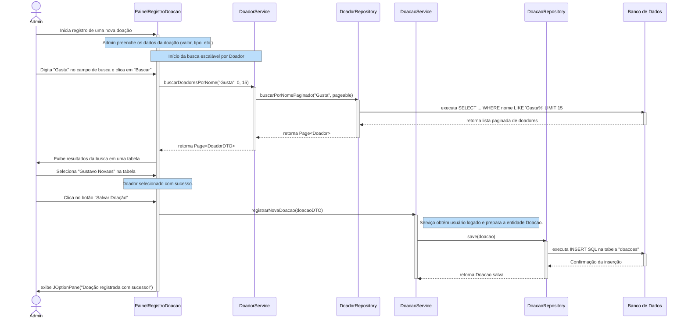

```mermaid
%%{
  init: {

    "themeVariables": {
      "noteBkgColor": "#BBDEFB",
      "noteTextColor": "000000",
      "noteBorderColor": "##0D47A1"
    }
  }
}%%
sequenceDiagram
    actor Admin
    participant V as PainelRegistroDoacao
    participant S_Doador as DoadorService
    participant R_Doador as DoadorRepository
    participant S_Doacao as DoacaoService
    participant R_Doacao as DoacaoRepository
    participant DB as Banco de Dados

    Admin->>+V: Inicia registro de uma nova doação
    
    Note over V: Admin preenche os dados da doação (valor, tipo, etc.)

    Note over V, S_Doador: Início da busca escalável por Doador
    Admin->>V: Digita "Gusta" no campo de busca e clica em "Buscar"
    
    V->>S_Doador: buscarDoadoresPorNome("Gusta", 0, 15)
    activate S_Doador
    
    S_Doador->>R_Doador: buscarPorNomePaginado("Gusta", pageable)
    activate R_Doador
    
    R_Doador->>DB: executa SELECT ... WHERE nome LIKE 'Gusta%' LIMIT 15
    activate DB
    DB-->>R_Doador: retorna lista paginada de doadores
    deactivate DB
    
    R_Doador-->>S_Doador: retorna Page<Doador>
    deactivate R_Doador
    
    S_Doador-->>V: retorna Page<DoadorDTO>
    deactivate S_Doador
    
    V->>Admin: Exibe resultados da busca em uma tabela
    
    Admin->>V: Seleciona "Gustavo Novaes" na tabela
    
    Note over V: Doador selecionado com sucesso.
    
    Admin->>V: Clica no botão "Salvar Doação"
    
    V->>S_Doacao: registrarNovaDoacao(doacaoDTO)
    activate S_Doacao

    Note right of S_Doacao: Serviço obtém usuário logado e prepara a entidade Doacao.

    S_Doacao->>R_Doacao: save(doacao)
    activate R_Doacao
    
    R_Doacao->>DB: executa INSERT SQL na tabela "doacoes"
    activate DB
    DB-->>R_Doacao: Confirmação da inserção
    deactivate DB
    
    R_Doacao-->>S_Doacao: retorna Doacao salva
    deactivate R_Doacao
    
    deactivate S_Doacao
    V->>-Admin: exibe JOptionPane("Doação registrada com sucesso!")
```