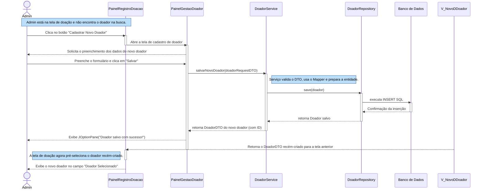

```mermaid
%%{
  init: {

    "themeVariables": {
      "noteBkgColor": "#BBDEFB",
      "noteTextColor": "#000000",
      "noteBorderColor": "#0D47A1"
    }
  }
}%%
sequenceDiagram
    actor Admin
    participant V_Doacao as PainelRegistroDoacao
    participant V_NovoDoador as PainelGestaoDoador
    participant S_Doador as DoadorService
    participant R_Doador as DoadorRepository
    participant DB as Banco de Dados

    Note over Admin, V_Doacao: Admin está na tela de doação e não encontra o doador na busca.

    Admin->>V_Doacao: Clica no botão "Cadastrar Novo Doador"

    activate V_Doacao
    V_Doacao->>V_NovoDoador: Abre a tela de cadastro de doador 
    deactivate V_Doacao
    
    activate V_NovoDoador
    V_NovoDoador-->>Admin: Solicita o preenchimento dos dados do novo doador
    
    Admin->>V_NovoDoador: Preenche o formulário e clica em "Salvar"
    
    V_NovoDoador->>S_Doador: salvarNovoDoador(doadorRequestDTO)
    activate S_Doador
    
    Note right of S_Doador: Serviço valida o DTO, usa o Mapper e prepara a entidade.
    
    S_Doador->>R_Doador: save(doador)
    activate R_Doador
    
    R_Doador->>DB: executa INSERT SQL
    activate DB
    DB-->>R_Doador: Confirmação da inserção
    deactivate DB
    
    R_Doador-->>S_Doador: retorna Doador salvo
    deactivate R_Doador
    
    S_Doador-->>V_NovoDoador: retorna DoadorDTO do novo doador (com ID)
    deactivate S_Doador
    
    V_NovoDoador-->>Admin: Exibe JOptionPane("Doador salvo com sucesso!")
    
    V_NovoDDoador-->>V_Doacao: Retorna o DoadorDTO recém-criado para a tela anterior
    
    deactivate V_NovoDoador
    activate V_Doacao
    Note left of V_Doacao: A tela de doação agora pré-seleciona o doador recém-criado.
    deactivate V_Doacao
    
    V_Doacao-->>Admin: Exibe o novo doador no campo "Doador Selecionado"
```