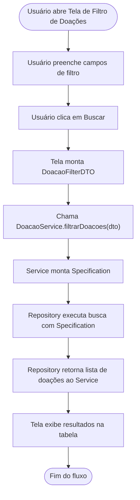

```mermaid
flowchart TD
    INICIO([Usuário abre Tela de Filtro de Doações])
    INICIO --> PREENCHER["Usuário preenche campos de filtro"]
    PREENCHER --> CLICAR[Usuário clica em Buscar]
    CLICAR --> CRIARDTO[Tela monta DoacaoFilterDTO]
    CRIARDTO --> CHAMARSERV["Chama DoacaoService.filtrarDoacoes(dto)"]
    CHAMARSERV --> MONTASPEC[Service monta Specification]
    MONTASPEC --> CONSULTAREPO[Repository executa busca com Specification]
    CONSULTAREPO --> RETORNAR[Repository retorna lista de doações ao Service]
    RETORNAR --> EXIBIR[Tela exibe resultados na tabela]
    EXIBIR --> FIM([Fim do fluxo])
```
