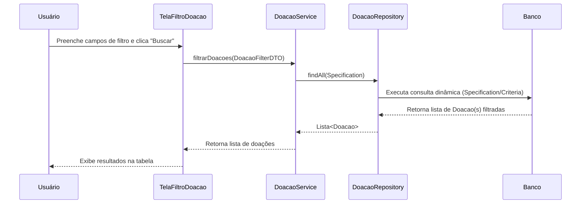

```mermaid
sequenceDiagram
    participant Usuário
    participant TelaFiltroDoacao
    participant DoacaoService
    participant DoacaoRepository
    participant Banco

    Usuário->>TelaFiltroDoacao: Preenche campos de filtro e clica "Buscar"
    TelaFiltroDoacao->>DoacaoService: filtrarDoacoes(DoacaoFilterDTO)
    DoacaoService->>DoacaoRepository: findAll(Specification)
    DoacaoRepository->>Banco: Executa consulta dinâmica (Specification/Criteria)
    Banco-->>DoacaoRepository: Retorna lista de Doacao(s) filtradas
    DoacaoRepository-->>DoacaoService: Lista<Doacao>
    DoacaoService-->>TelaFiltroDoacao: Retorna lista de doações
    TelaFiltroDoacao-->>Usuário: Exibe resultados na tabela
```